# ldrgen

ldrgen is a golang cli tool for rapid generation of shellcode loaders using pre-defined templates.

> ⚠️ this tool is meant to help with running beacon from disk, this does **not** help with evasion for memory scans or post-exploitation- OPSEC considerations are up to the discretion of the operator.

## Getting Started
There are available binaries on the [releases](https://github.com/gatariee/ldrgen/releases) page, or you can build from source for the latest version.

### Releases
Standalone binaries are available, however you will need a `templates` directory to be ingested by the generator. You can find the latest templates from source [here](./templates/) or it should be included as a zip file in the release.

Templates are expected to be in the same directory as where the binary is executed, but you can specify with the `--template` flag.

### Building from Source
```bash
cd ldrgen/src
make build

cd bin
ldrgen --help
```

## Usage
The concept of this tool is quite simple, you provide raw shellcode, as well as a loader token, and the tool will generate the loader source code file for you.

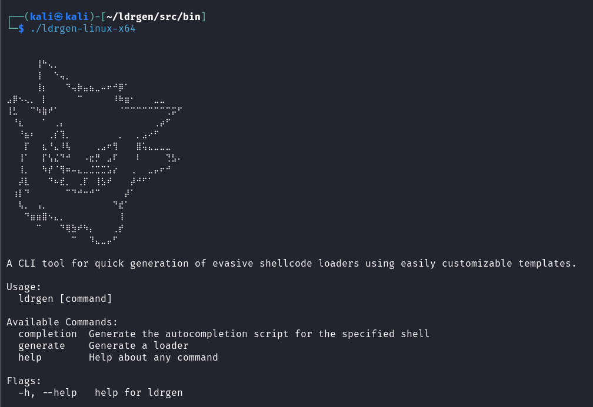

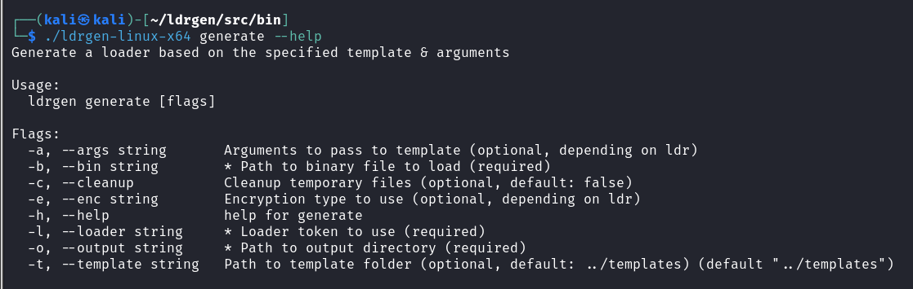

### Calculator Shellcode 
This example will use the `CreateThread` loader token and [boku7's null-free calculator shellcode](https://github.com/boku7/x64win-DynamicNoNull-WinExec-PopCalc-Shellcode).

```bash
./ldrgen generate --template [path_to_template_folder] --bin [path_to_shellcode] --output [path_to_output_folder] --loader CreateThread
```
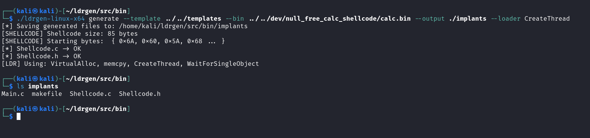

The source code of the loader will be generated in the specified output folder along with a generic `makefile` to build the loader, or you can build it yourself.

```bash
make [x64 | x86]
```

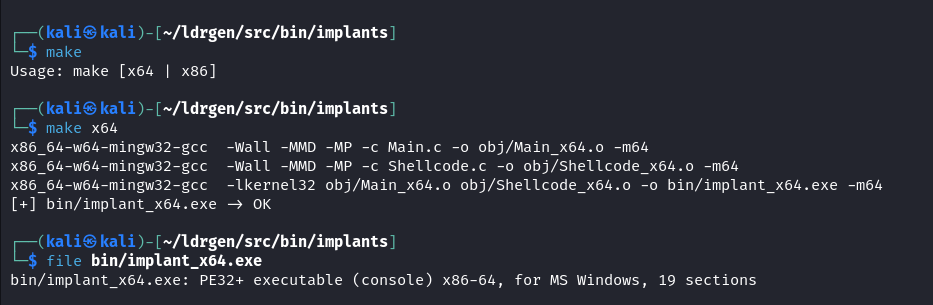

Transfer the implant to your Windows machine, and execute the loader.

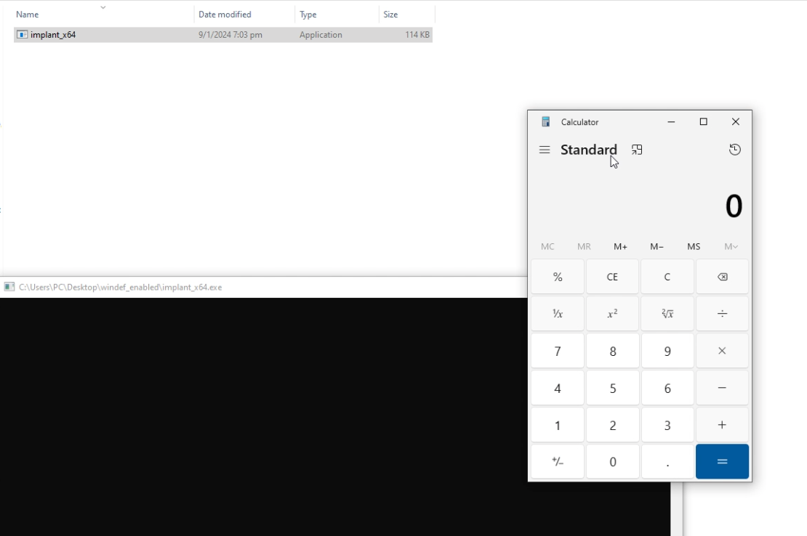

### Usage for AV Evasion
The main purpose of this tool is to help with AV evasion especially when compiling loaders for very highly signatured beacons (e.g cobalt strike, meterpreter), or running post-exploitation tools from disk without being nuked by AV.

The following examples will use the loader token `EarlyBirdAPC_Buffed` which uses the following techniques (in order):

> ✅ All WinAPI function calls are dynamically resolved at runtime from a calculated hash unless otherwise stated, see [hash.py](./templates/Scripts/hash.py) for more information on the hashing algorithm.

* Attempts sandbox evasion by counting to `10000000000`, takes roughly ~30-45 seconds to complete.
* Runtime dynamic resolution of WinAPIs from `kernel32.dll` 
* Spawns user controlled process in suspended state - denoted by `${ PNAME }`
    - Uses `CreateProcessW` resolved from `kernel32.dll` 
    - See: [EarlyBirdAPC_Buffed.c - Line 213](./templates/Source/EarlyBirdAPC_Buffed.c#L213)
* Allocates memory in the suspended process with the size of the shellcode
    - Uses `VirtualAllocEx` resolved from `kernel32.dll` to allocate PAGE_EXECUTE_READWRITE (RWX) memory of the size of the shellcode - denoted by `${ SHELLCODE_SIZE }`
    - See: [Shellcode.c - Line 3](./templates/Source/Shellcode.c#L3)
* Begins a routine to XOR decrypt the shellcode in memory with a user-defined key - denoted by `${ KEY }`
    - See [EarlyBirdAPC_Buffed.c - Line 236](./templates/Source/EarlyBirdAPC_Buffed.c#236)
    - Uses an XOR function from [Xor.c](./templates/Source/Xor.c) to decrypt the shellcode in memory

* Writes the shellcode buffer to the allocated memory
    - Uses `WriteProcessMemory` resolved from `kernel32.dll` to write the shellcode to the allocated memory - denoted by `${ SHELLCODE }`
    - See: [Shellcode.c - Line 2](./templates/Source/Shellcode.c#L2)

* Queues an APC to the suspended thread, resumes the thread and waits for process to exit via `WaitForSingleObject`
* Cleans up the allocated memory, and closes handles, before dying gracefully.

#### Cobalt Strike Beacon
The following is usage of ldrgen to generate a loader for Cobalt Strike's beacon using the `EarlyBirdAPC_Buffed` token.

> ⚠️ In this example, Windows Defender (9/1/2024) is **enabled** and **up-to-date**.

1. Generate the beacon shellcode 
  - Payloads -> Stageless Payload Generator -> Output -> Raw
  - Default output name is: `payload_x64.bin`

    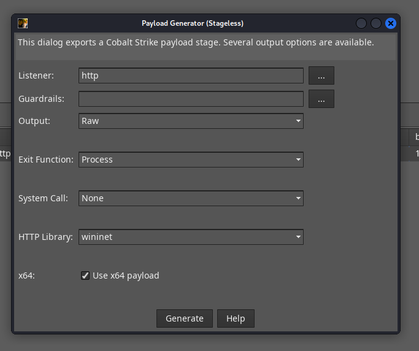

2. Generate the loader
```bash
ldrgen-linux-x64 generate --template ../../templates --bin payload_x64.bin --output implants --loader EarlyBirdAPC_Buffed --enc xor --args "key=2adc118cdd0ae, pname=C:\\\Windows\\\system32\\\cmd.exe"     

Loader          ->    EarlyBirdAPC_Buffed
Encoding Type   ->    xor
Key:            ->    2adc118cdd0ae
Process Name    ->    C:\\Windows\\system32\\cmd.exe
```
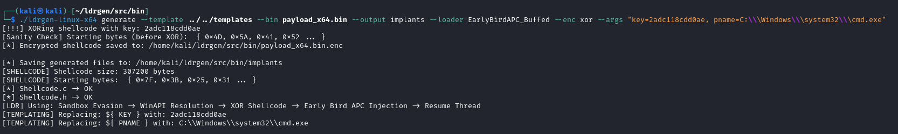

3. Compile the loader
```bash
cd implants && make x64
```

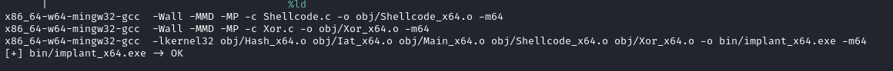

4. Transfer implant to victim machine, and execute the loader.

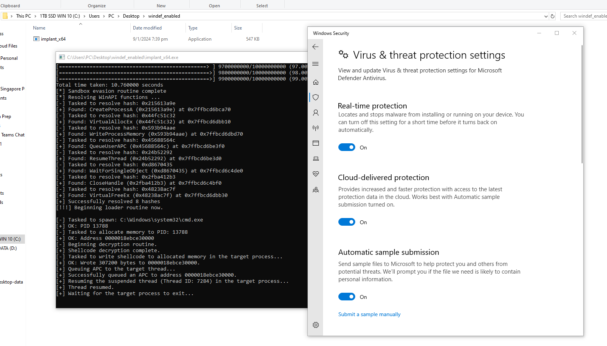

5. Check that beacon callback was successful.

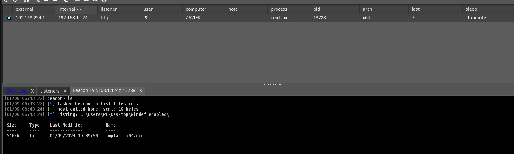

> ⚠️ OPSEC Note: The beacon used and generated has **no in memory evasion** and will 100% be killed if you trigger a memory scan or perform any OPSEC unsafe actions.

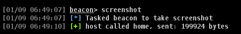

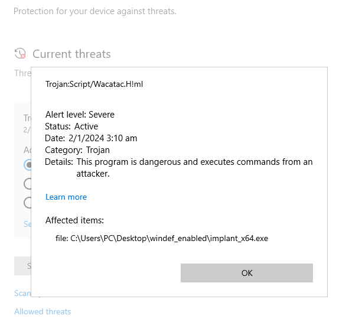

