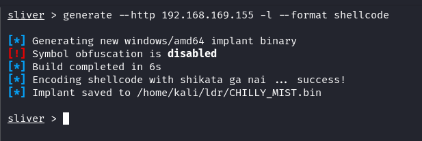
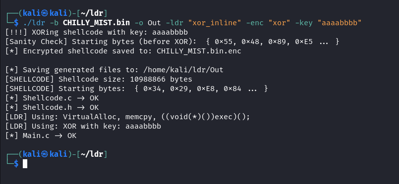
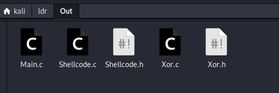
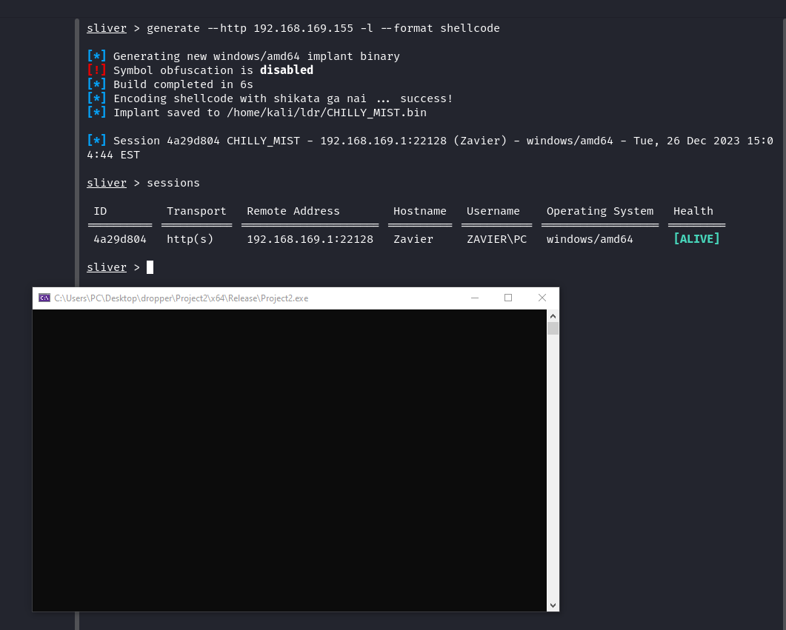
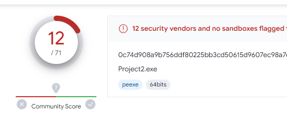

# ldrgen

ldrgen is a golang cli tool to generate shellcode loaders

## Usage
```
go build .
./ldrgen -h
```

## Why?
when ur doing a box and your beacons die when dropping / running from disk 

## How?
1. generate your shellcode



2. `./ldr -b <bin_path> -o <out_file> -ldr <loader_type> -enc <encryption_type> -key <encryption_key>`



3. loader source code will be generated in `out_file`



4. compile & run the loader



5. profit?


